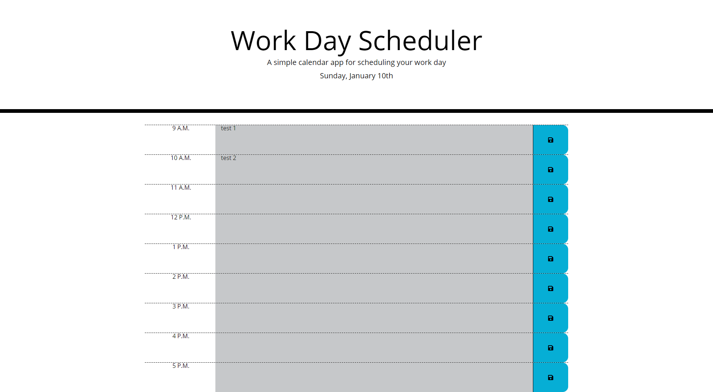

# Work Day Scheduler 

## Purpose
Refactor given code to allow the user to click on an hour in the work day scheduler and enter a task. The user should then click on the save icon to save the inforamtion. The tasks/calender should be color coded based on how close the task is to being due. All of the information should still be there upon a page refresh/close&reopen. 

## Built With
* HTML (given)
* CSS (given)
* Java Script (jQuery)

## Contents
1 html file and a Develop folder. The develop folder contains the style sheet and script file.

## Website
https://dragoonkite.github.io/work-day-scheduler-api-challange/

## Contribution
Made with ❤️ by DragoonKite

### ©️2020 Frank DePaolo